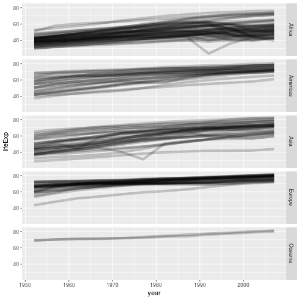
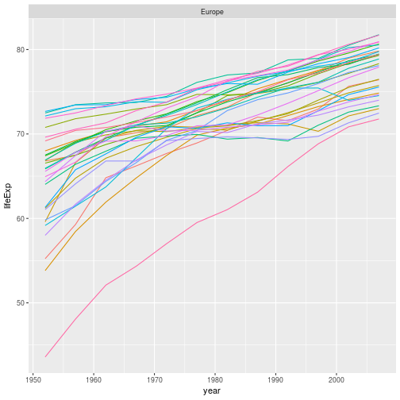
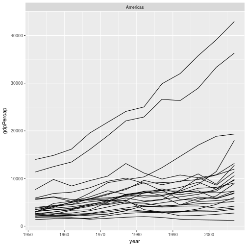
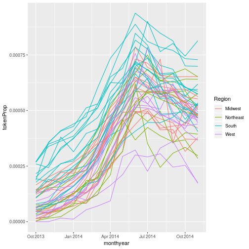
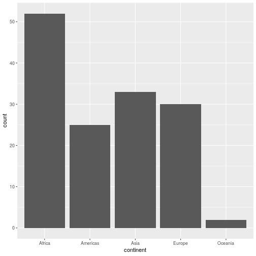
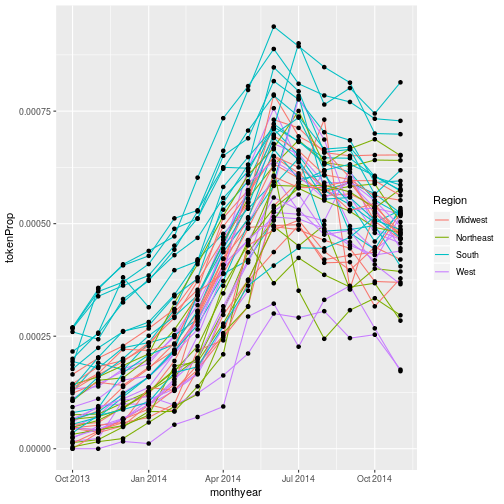
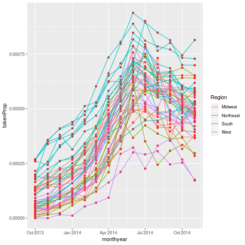
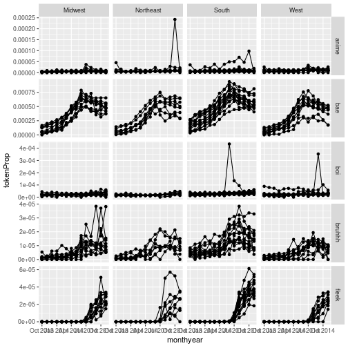
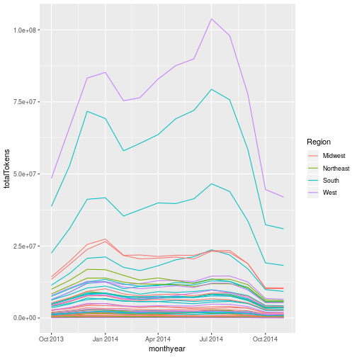
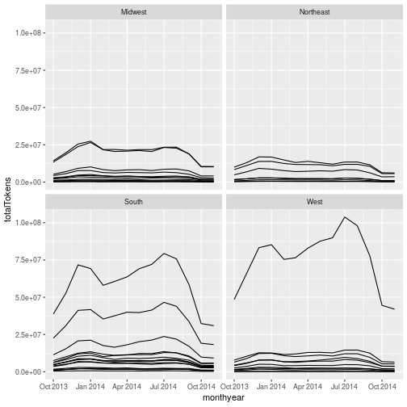

Plotting our data is one of the best ways to
quickly explore it and the various relationships
between variables.

There are three main plotting systems in R,
the [base plotting system][base], the [lattice][lattice]
package, and the [ggplot2][ggplot2] package.

[base]: http://www.statmethods.net/graphs/
[lattice]: http://www.statmethods.net/advgraphs/trellis.html
[ggplot2]: http://www.statmethods.net/advgraphs/ggplot2.html

Today we'll be learning about the ggplot2 package, which is part of the tidyverse.  It is the most effective for creating 
publication quality graphics. There are many extension packages for ggplot2, which make it easy to produce specialised types of
graph, such as survival plots, geographic maps and ROC curves.

ggplot2 is built on the grammar of graphics, the idea that any plot can be
expressed from the same set of components: a **data** set, a
**coordinate system**, and a set of **geoms**--the visual representation of data
points.    

The key to understanding ggplot2 is thinking about a figure in layers.
This idea may be familiar to you if you have used image editing programs like Photoshop, Illustrator, or
Inkscape.

Let's start off with an example, using our gapminder data:

~~~
ggplot(data = gapminder, aes(x = gdpPercap, y = lifeExp)) +
  geom_point()
~~~
{: .language-r}

So the first thing we do is call the `ggplot` function. This function lets R
know that we're creating a new plot, and any of the arguments we give the
`ggplot` function are the *global* options for the plot: they apply to all
layers on the plot.

We've passed in two arguments to `ggplot`. First, we tell `ggplot` what data we
want to show on our figure, in this example the gapminder data we read in
earlier. For the second argument we passed in the `aes` function, which
tells `ggplot` how variables in the **data** map to *aesthetic* properties of
the figure, in this case the **x** and **y** locations. Here we told `ggplot` we
want to plot the "gdpPercap" column of the gapminder data frame on the x-axis, and
the "lifeExp" column on the y-axis. 

By itself, the call to `ggplot` isn't enough to draw a figure:

~~~
ggplot(data = gapminder, aes(x = gdpPercap, y = lifeExp))
~~~
{: .language-r}

We need to tell `ggplot` how we want to visually represent the data, which we
do by adding a new **geom** layer. In our example, we used `geom_point`, which
tells `ggplot` we want to visually represent the relationship between **x** and
**y** as a scatter-plot of points:

~~~
ggplot(data = gapminder, aes(x = gdpPercap, y = lifeExp)) +
  geom_point()
~~~
{: .language-r}

## Combining `dplyr` and `ggplot2`

As `gplot2` is part of the tidyverse, we can use it with pipes.  As we will see later in the 
episode, this will be particularly useful if we need to modify the data before plotting it.

We can repeat the above plot, using a pipe, as follows:

~~~
gapminder %>% ggplot(aes(x = gdpPercap, y = lifeExp)) + geom_point()
~~~
{: .language-r}

Note that the `ggplot2` commands are joined by the `+` symbol and not the `%>%` symbol.  It may help to remember that we **add** layers to our plot.

> ## Challenge 1
>
> Modify the example so that the figure shows how life expectancy has
> changed over time.  Note that using points to show this data isn't the 
> most effective way of presenting it; we will look at other ways of showing
> the data shortly.
>
> Hint: the gapminder dataset has a column called "year", which should appear
> on the x-axis.
>
> > ## Solution to challenge 1
> >
> > Here is one possible solution:
> >
> > 
> > ~~~
> > gapminder %>%  ggplot(aes(x = year, y = lifeExp)) + geom_point()
> > ~~~
> > {: .language-r}
> > 
> > 
> >
> {: .solution}
{: .challenge}

>
> ## Challenge 2
>
> In the previous examples and challenge we've used the `aes` function to tell
> the scatterplot **geom** about the **x** and **y** locations of each point.
> Another *aesthetic* property we can modify is the point *color*. Modify the
> code from the previous challenge to **color** the points by the "continent"
> column. What trends do you see in the data? Are they what you expected?
>
> > ## Solution to challenge 2
> >
> > In the previous examples and challenge we've used the `aes` function to tell
> > the scatterplot **geom** about the **x** and **y** locations of each point.
> > Another *aesthetic* property we can modify is the point *color*. Modify the
> > code from the previous challenge to **color** the points by the "continent"
> > column. What trends do you see in the data? Are they what you expected?
> >
> > 
> > ~~~
> > gapminder %>% ggplot(aes(x = year, y = lifeExp, color = continent)) +
> >   geom_point()
> > ~~~
> > {: .language-r}
> > 
> > 
> >
> {: .solution}
{: .challenge}

## Layers

Using a scatter-plot probably isn't the best for visualizing change over time.
Instead, let's tell `ggplot` to visualize the data as a line plot.  If we replace `geom_point()` with
`geom_line()`, we obtain:

~~~
gapminder %>%  ggplot(aes(x = year, y = lifeExp, colour = continent )) + geom_line()
~~~
{: .language-r}

This probably isn't what you were expecting.   We need to modify the aesthetic to tell 
ggplot that each country's data should be a separate line.   By default, `geom_point()` 
joins all our observations together, sorting them in order of the variable we're plotting
on the x axis.   To generate a separate line for each country, we use the `group` aesthetic:

~~~
gapminder %>%  ggplot(aes(x = year, y = lifeExp, group = country, color = continent)) +
  geom_line()
~~~
{: .language-r}

But what if we want to visualize both lines and points on the plot? We can
add another layer to the plot:

~~~
gapminder %>% ggplot(aes(x = year, y = lifeExp, group = country, color = continent)) +
  geom_line() + geom_point()
~~~
{: .language-r}

At the moment the aesthetic we defined applies to all of the plot layers; both the points
and the lines are coloured according to their continent. We can apply an aesthetic to certain layers
the plot by supplying them with their own aesthetic.  For example, if we remove the `color` option, we aren't
mapping any aspect of the data to the colour property of any part of the graph - all the points and lines have the same
colour:

~~~
gapminder %>% ggplot(aes(x = year, y = lifeExp, group = country)) +
  geom_line() + geom_point()
~~~
{: .language-r}

If we apply the aesthetic `aes(colour=continent)` to `geom_line()`, the (lack of) mapping of colour 
is overridden by the new aesthetic.  The points' colours are unchanged:

~~~
gapminder %>% ggplot(aes(x = year, y = lifeExp, group = country)) +
  geom_line(aes(colour=continent)) + geom_point()
~~~
{: .language-r}

What if we want to print our points in a colour other than the default black?  Aesthetics map
data to a property of the graph.  If we want to change the colour of all our points, we are not using 
the data to specify the colour, so we specify the colour directly in the geom:

~~~
gapminder %>% 
  ggplot(aes(x = year, y = lifeExp, group = country)) +
  geom_line(aes(colour = continent)) +
  geom_point(colour = "red")
~~~
{: .language-r}

It's important to note that each layer is drawn on top of the previous layer. In
this example, the points have been drawn *on top of* the lines. If we swap the order
of our `geom_line()` and `geom_point()`, the points appear **behind** the lines:

~~~
gapminder %>% 
  ggplot(aes(x = year, y = lifeExp, group = country)) +
  geom_point(colour = "red") + 
  geom_line(aes(colour = continent)) 
~~~
{: .language-r}

> ## Tip: Transparency
>
> If you have a lot of data or many layers, it can be useful to make some (semi)-transparent.
> You can do this by setting the `alpha` property to a value between 0 (fully transparent), and 1 (fully opaque).
{: .callout}

## Multi-panel figures

There's still a lot going on in this graph.  It may clearer if we plotted a separate graph
for each continent. We can split the plot into  multiple panels by adding a layer of **facet** panels: 

~~~
gapminder %>% ggplot(aes(x = year, y = lifeExp, group = country)) +
  geom_line() + facet_wrap("continent")
~~~
{: .language-r}

We have removed
`colour=continent` from the aesthetic since colouring each line by continent conveys no additional
information.  Note that the variable we are faceting by needs to be placed in quotes.

> ## More on facetting
> 
> It's also possible to facet by one or two variables on a grid, using the `facet_grid()` function.  For example, we could plot life GDP per capita's relationship to life expectancy for each combination of continent and year 
> using the following code:
> 
> 
> ~~~
> gapminder %>% 
>   ggplot(aes(x=lifeExp, y=gdpPercap)) + geom_point(size=0.3) + 
>   facet_grid(continent ~ year)
> ~~~
> {: .language-r}
> 
> 
> This uses R's formula notation to specify how we want to arrange to grid; see `?facet_grid` for more details.
> 
{: .callout}

> ## Challenge 3
> 
> In this challenge you will explore how each country's GDP per capita has changed with time.
> 
> Try two different approaches to visualising this data:
> 
> * Plot all the data on a single graph, colouring each country's data by continent
> * Facet the data by continent.
> 
> > ## Solution to challenge 3
> > 
> > * Plot all the data on a single graph, colouring each country's data by continent
> > 
> > 
> > ~~~
> > gapminder %>% 
> >   ggplot(aes(x = year, y = gdpPercap, group = country, colour = continent)) + 
> >   geom_line()
> > ~~~
> > {: .language-r}
> > 
> > 
> > 
> > * Facet the data by continent.
> > 
> > 
> > ~~~
> > gapminder %>% 
> >   ggplot(aes(x = year, y = gdpPercap, group = country)) +
> >   geom_line() +
> >   facet_wrap("continent")
> > ~~~
> > {: .language-r}
> > 
> > 
> > 
> > This representation of the data is arguably clearer.  Neither graph is ideal though; the huge range of 
> > GDPs per capita makes it difficult to show the data on the same graph.  We will look at transforming the scales of our axes
> > shortly.
> > 
> > Another approach is to allow each facet to have its own scale on the y axis.   This can be done by
> > passing the `scales = "free_y"` option to `facet_wrap()`.  This can be useful in some circumstances.  It does, however, make
> > it very difficult to compare data in different continents, and is arguably misleading.
> > 
> {: .solution}
{: .challenge}

## Pre processing data

When we want to start sub-setting and mutating the data before plotting, the usefulness of
"piped" data-analysis becomes apparent; we can perform our data transformations and then
send the result to `ggplot2` without making an intermediate data set.

For example, if we wanted to produce a version of the graph in challenge 3, but only for countries in the Americas, we could use:

~~~
gapminder %>% 
  filter(continent == "Americas") %>% 
  ggplot(aes(x = year, y = gdpPercap, group = country)) +
  geom_line() +
  facet_wrap("continent")
~~~
{: .language-r}

## Transformations 

Ggplot also makes it easy to transform axes, to better show our data.  To
demonstrate we'll go back to our first example:

~~~
gapminder %>% ggplot(aes(x = gdpPercap, y = lifeExp)) +
  geom_point()
~~~
{: .language-r}

Currently it's hard to see the relationship between the points due to some strong
outliers in GDP per capita. We can change the scale of units on the x axis using
the *scale* functions. These control the mapping between the data values and
visual values of an aesthetic. We also modify the transparency of the
points, using the *alpha* function, which is especially helpful when you have
a large amount of data which is very clustered.

~~~
gapminder %>% ggplot(aes(x = gdpPercap, y = lifeExp)) +
  geom_point(alpha = 0.5) + scale_x_log10()
~~~
{: .language-r}

The `scale_x_log10` function applied a transformation to the values of the gdpPercap
column before rendering them on the plot, so that each multiple of 10 now only
corresponds to an increase in 1 on the transformed scale, e.g. a GDP per capita
of 1,000 is now 3 on the x axis, a value of 10,000 corresponds to 4 on the x-
axis and so on. This makes it easier to visualize the spread of data on the
x-axis.  If we want plot the y-axis on a log scale we can use the `scale_y_log10` function.

> ## Challenge 4 
> 
> Modify the faceted plot you produced in challenge 3 to show GDP per capita on a log scale.
> 
> > ## Solution to challenge 4
> > 
> > We can add the `scale_y_log10()` to our plotting command:
> > 
> > 
> > ~~~
> > gapminder %>% 
> >   ggplot(aes(x = year, y = gdpPercap, group = country)) +
> >   geom_line() +
> >   facet_wrap("continent") + 
> >   scale_y_log10()
> > ~~~
> > {: .language-r}
> > 
> > 
> > 
> > Although this makes it easier to visualise all of the data on a single plot, it makes the inequality in GDP per capita
> > between the difference continents much less obvious.  
> > 
> > If we plot the data with a linear scale the inequality is more obvious, but this masks the individual trajectories of
> > many countries' GDPs . Decisions about how best to plot data are beyond the scope of this course.  Research IT offers a course, [Introduction to data visualisation and analysis](https://app.manchester.ac.uk/rintrovis), which covers this topic in much more detail.
> > 
> {: .solution}
{: .challenge}

## Plotting 1D data

In the examples so far we've plotted one variable against another.  Often we wish to plot single variable. We can
plot counts using `geom_bar()`.  For example, to plot the number of counties in the gapminder data that are in each
continent we can use:

~~~
gapminder %>% filter(year == 2007) %>%
  ggplot(aes(x=continent)) + 
  geom_bar()
~~~
{: .language-r}

We filter to a single year of data to avoid multiple counting

We often wish to explore the distribution of a continuous variable.  We can do this using a histogram (`geom_histogram()`), 
or a density plot (`geom_density()`)

For example, to produce a histogram of GDPs per capita for countries in Europe in 2007:

~~~
gapminder %>% filter(year == 2007, continent == "Europe") %>% 
  ggplot(aes(x=gdpPercap)) + geom_histogram(bins = 10)
~~~
{: .language-r}

We can specify the number of bins (`bins = `), or the width of a bin (`binwidth = `).

We can plot a density plot using `geom_density()`.  This is a smoothed version of a histogram.

~~~
gapminder %>% 
  filter(year == 2007, continent == "Europe") %>% 
  ggplot(aes(x = gdpPercap)) + 
  geom_density() 
~~~
{: .language-r}

By default the density estimate is drawn in outline (i.e. it isn't filled in).  We can use the `fill` attribute to fill it in; this can be
passed in the aesthetic (e.g. `aes(x = gdpPercap, fill = ...))`) to fill according to the data, or directly to `geom_density()`.

> ## Challenge 5
> 
> In this challenge, we'll extend the plot above to compare the distributions of GDP per capita in Europe and Africa over time.
> As the challenge is quite long, it's broken down into sections.  _Please_ try each section
> beforelooking at the answer.
>
> a.  We'll start off by plotting the data for a single year, before extending the plot for multiple years.  Using the code above as a starting point, write some code to return a tibble containing the data for Europe and Africa in 2007.  Hint: the `%in%` operator may be useful.
>
> > ## Solution a
> > 
> > 
> > ~~~
> > gapminder %>% 
> >   filter(year == 2007) %>% 
> >   filter(continent %in% c("Europe", "Africa"))
> > ~~~
> > {: .language-r}
> > 
> > 
> > 
> > ~~~
> > # A tibble: 82 x 6
> >                   country  year      pop continent lifeExp gdpPercap
> >                     <chr> <int>    <dbl>     <chr>   <dbl>     <dbl>
> >  1                Albania  2007  3600523    Europe  76.423  5937.030
> >  2                Algeria  2007 33333216    Africa  72.301  6223.367
> >  3                 Angola  2007 12420476    Africa  42.731  4797.231
> >  4                Austria  2007  8199783    Europe  79.829 36126.493
> >  5                Belgium  2007 10392226    Europe  79.441 33692.605
> >  6                  Benin  2007  8078314    Africa  56.728  1441.285
> >  7 Bosnia and Herzegovina  2007  4552198    Europe  74.852  7446.299
> >  8               Botswana  2007  1639131    Africa  50.728 12569.852
> >  9               Bulgaria  2007  7322858    Europe  73.005 10680.793
> > 10           Burkina Faso  2007 14326203    Africa  52.295  1217.033
> > # ... with 72 more rows
> > ~~~
> > {: .output}
> > This returns a tibble, which we can then pipe into ggplot.
> {: .solution}
> 
> b. Pipe the results of part a into ggplot, to make a density plot of GDP per capita, coloured by continent (e.g. each continent has its own density estimate)
> 
> > ## Solution b
> > 
> > 
> > ~~~
> > gapminder %>% 
> >   filter(year == 2007) %>% 
> >   filter(continent %in% c("Europe", "Africa")) %>% 
> >   ggplot(aes(x = gdpPercap, fill = continent)) +
> >   geom_density()
> > ~~~
> > {: .language-r}
> > 
> > 
> >
> {: .solution}
>
> c. This looks OK, but the continent's density estimates overlay each other.  Use the `alpha =` option to make each density estimate
> semi transparent
>
> > ## Solution c
> >
> > 
> > ~~~
> > gapminder %>% 
> >   filter(year == 2007) %>% 
> >   filter(continent %in% c("Europe", "Africa")) %>% 
> >   ggplot(aes(x = gdpPercap, fill = continent)) +
> >   geom_density(alpha = 0.5) 
> > ~~~
> > {: .language-r}
> > 
> > 
> > 
> {: .solution}
> 
> d.  Let's take a look at how the relative GDPs per capita have changed over time.  We can use `facet_wrap()` to do  this.  
> Modify your code to produce a separate graph for each year
>
>
> > ## Solution d
> >
> > 
> > ~~~
> > gapminder %>% 
> >   filter(continent %in% c("Europe", "Africa")) %>% 
> >   ggplot(aes(x =gdpPercap, fill = continent)) +
> >   geom_density(alpha = 0.5) +
> >   facet_wrap("year")
> > ~~~
> > {: .language-r}
> > 
> > 
> > Note that you need to remove the `filter(year == 2007)` line from the code.
> >
> {: .solution}
{: .challenge}
  

## Modifying text

To clean this figure up for a publication we need to change some of the text
elements.  For example the axis labels should be "human readable" rather than 
the variable name from the data-set.  We may also wish to change the text size, etc.

We can do this by adding a couple of different layers. The **theme** layer
controls the axis text, and overall text size. Labels for the axes, plot 
title and any legend can be set using the `labs` function. Legend titles
are set using the same names we used in the `aes` specification. Thus below
the colour legend title is set using `color = "Continent"`, while the title 
of a fill legend would be set using `fill = "MyTitle"`. 

~~~
gapminder %>% 
  filter(continent %in% c("Europe", "Africa")) %>% 
  ggplot(aes(x = gdpPercap, fill = continent)) +
  geom_density(alpha = 0.5) +
  facet_wrap("year") + 
  labs(
    x = "GDP per capita", # x axis title
    y = "Density",   # y axis title
    title = "Figure 1",      # main title of figure
    fill = "Continent"      # title of legend
  ) 
~~~
{: .language-r}

RStudio provides a really useful [cheat sheet][cheat] of the different layers available, and more
extensive documentation is available on the [ggplot2 website][ggplot-doc].

[cheat]: http://www.rstudio.com/wp-content/uploads/2015/03/ggplot2-cheatsheet.pdf
[ggplot-doc]: http://docs.ggplot2.org/current/

## Saving plots

Having produced a plot, we can save it, or copy it to the clipboard using the "Export" command at the top of RStudio's plot window.

It's a better idea to save your plots as part of your scripts; this way if you modify your analysis code, you _know_ the plot will reflect the results of the code.  If you manually save the plot, you have to remember to do this after running the script.  

We can save the most recently produced ggplot using the `ggsave()` function:

~~~
ggsave("plots/myplot.png")
# Can also set the size of plot
ggsave("plots/myplot.pdf", width = 20, height = 20, units = "cm")
~~~
{: .language-r}

The help for the `ggsave()` function lists the image formats that are available, as well as the options for setting the resolution and size of the saved image.

## ggplot themes and extensions

ggplot is very flexible, and its capabilities can be extended.  

The _theme_ of a plot affects the background, axes etc.  The [ggplot2 themes package](https://cran.r-project.org/web/packages/ggthemes/) contains many useful (and not so useful) themes we can apply to our data.  The [cowplot package](https://cran.r-project.org/web/packages/cowplot/index.html) makes it easy to plot sub-plots, and to overlay plots within plots.  

The [ggplot2 exensions](http://www.ggplot2-exts.org/) pages lists R packages that can extend its capabilities. If you have a specialised plotting need (for example plotting ROC curves, survival data, or time series) there are packages that will allow you to make these plots with minimal effort. [The top 50 ggplot2 visualisations page](http://r-statistics.co/Top50-Ggplot2-Visualizations-MasterList-R-Code.html) provides examples (with full code) of almost any type of graph you might want to make. 

As an example of how easy it can be to extend ggplot, we will use the `ggridges` plot to produce a stacked density plot, to better visualise the previous figure:

~~~
library(ggridges)
gapminder %>% 
  filter(continent %in% c("Europe", "Africa")) %>% 
  ggplot(aes(x = gdpPercap, y = factor(year), fill = continent)) +
  geom_density_ridges(alpha = 0.5) 
~~~
{: .language-r}

~~~
Picking joint bandwidth of 1850
~~~
{: .output}

