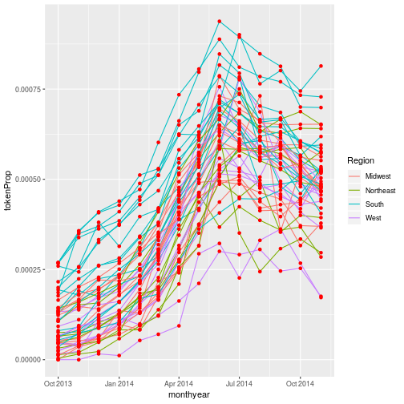
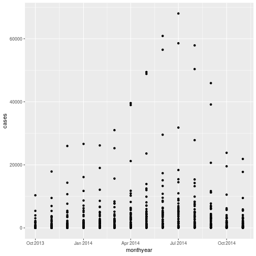

Plotting our data is one of the best ways to
quickly explore it and the various relationships
between variables.

There are three main plotting systems in R,
the [base plotting system][base], the [lattice][lattice]
package, and the [ggplot2][ggplot2] package.

[base]: http://www.statmethods.net/graphs/
[lattice]: http://www.statmethods.net/advgraphs/trellis.html
[ggplot2]: http://www.statmethods.net/advgraphs/ggplot2.html

Today we'll be learning about the ggplot2 package, because
it is the most effective for creating publication quality
graphics.  It is also part of the tidyverse.

ggplot2 is built on the grammar of graphics, the idea that any plot can be
expressed from the same set of components: a **data** set, a
**coordinate system**, and a set of **geoms**--the visual representation of data
points.

The key to understanding ggplot2 is thinking about a figure in layers.
This idea may be familiar to you if you have used image editing programs like Photoshop, Illustrator, or
Inkscape.

Let's start off with an example, using our gapminder data:

~~~
ggplot(data = gapminder, aes(x = gdpPercap, y = lifeExp)) +
  geom_point()
~~~
{: .language-r}

So the first thing we do is call the `ggplot` function. This function lets R
know that we're creating a new plot, and any of the arguments we give the
`ggplot` function are the *global* options for the plot: they apply to all
layers on the plot.

We've passed in two arguments to `ggplot`. First, we tell `ggplot` what data we
want to show on our figure, in this example the gapminder data we read in
earlier. For the second argument we passed in the `aes` function, which
tells `ggplot` how variables in the **data** map to *aesthetic* properties of
the figure, in this case the **x** and **y** locations. Here we told `ggplot` we
want to plot the "gdpPercap" column of the gapminder data frame on the x-axis, and
the "lifeExp" column on the y-axis. 

By itself, the call to `ggplot` isn't enough to draw a figure:

~~~
ggplot(data = gapminder, aes(x = gdpPercap, y = lifeExp))
~~~
{: .language-r}

We need to tell `ggplot` how we want to visually represent the data, which we
do by adding a new **geom** layer. In our example, we used `geom_point`, which
tells `ggplot` we want to visually represent the relationship between **x** and
**y** as a scatter-plot of points:

~~~
ggplot(data = gapminder, aes(x = gdpPercap, y = lifeExp)) +
  geom_point()
~~~
{: .language-r}

## Combining `dplyr` and `ggplot2`

As `gplot2` is part of the tidyverse, we can use it with pipes.  As we will see later in the 
episode, this will be particularly useful if we need to modify the data before plotting it.

We can repeat the above plot, using a pipe, as follows:

~~~
gapminder %>% ggplot(aes(x = gdpPercap, y = lifeExp)) + geom_point()
~~~
{: .language-r}

Note that the `ggplot2` commands are joined by the `+` symbol and not the `%>%` symbol.  It may help to remember that we **add** layers to our plot.

> ## Challenge 1
>
> Modify the example so that the figure shows how life expectancy has
> changed over time.  Note that using points to show this data isn't the 
> most effective way of presenting it; we will look at other ways of showing
> the data shortly.
>
> Hint: the gapminder dataset has a column called "year", which should appear
> on the x-axis.
>
> > ## Solution to challenge 1
> >
> > Here is one possible solution:
> >
> > 
> > ~~~
> > gapminder %>%  ggplot(aes(x = year, y = lifeExp)) + geom_point()
> > ~~~
> > {: .language-r}
> > 
> > 
> >
> {: .solution}
{: .challenge}

>
> ## Challenge 2
>
> In the previous examples and challenge we've used the `aes` function to tell
> the scatterplot **geom** about the **x** and **y** locations of each point.
> Another *aesthetic* property we can modify is the point *color*. Modify the
> code from the previous challenge to **color** the points by the "continent"
> column. What trends do you see in the data? Are they what you expected?
>
> > ## Solution to challenge 2
> >
> > In the previous examples and challenge we've used the `aes` function to tell
> > the scatterplot **geom** about the **x** and **y** locations of each point.
> > Another *aesthetic* property we can modify is the point *color*. Modify the
> > code from the previous challenge to **color** the points by the "continent"
> > column. What trends do you see in the data? Are they what you expected?
> >
> > 
> > ~~~
> > gapminder %>% ggplot(aes(x = year, y = lifeExp, color = continent)) +
> >   geom_point()
> > ~~~
> > {: .language-r}
> > 
> > 
> >
> {: .solution}
{: .challenge}

## Layers

Using a scatter-plot probably isn't the best for visualizing change over time.
Instead, let's tell `ggplot` to visualize the data as a line plot.  If we replace `geom_point()` with
`geom_line()`, we obtain:

~~~
gapminder %>%  ggplot(aes(x = year, y = lifeExp, colour = continent )) + geom_line()
~~~
{: .language-r}

This probably isn't what you were expecting.   We need to modify the aesthetic to tell 
ggplot that each country's data should be a separate line.   By default, `geom_point()` 
joins all our observations together, sorting them in order of the variable we're plotting
on the x axis.   To generate a separate line for each country, we use the `group` option:

~~~
gapminder %>%  ggplot(aes(x = year, y = lifeExp, group = country, color = continent)) +
  geom_line()
~~~
{: .language-r}

But what if we want to visualize both lines and points on the plot? We can
add another layer to the plot:

~~~
gapminder %>% ggplot(aes(x = year, y = lifeExp, group = country, color = continent)) +
  geom_line() + geom_point()
~~~
{: .language-r}

At the moment the aesthetic we defined applies to all of the plot layers; both the points
and the lines are coloured according to their continent. We can apply an aesthetic to certain layers
the plot by supplying them with their own aesthetic.  For example, if we remove the `color` option, we aren't
mapping any aspect of the data to the colour proprerty of any part of the graph - all the points and lines have the same
colour:

~~~
gapminder %>% ggplot(aes(x = year, y = lifeExp, group = country)) +
  geom_line() + geom_point()
~~~
{: .language-r}

If we apply the aesthetic `aes(colour=continent)` to `geom_line()`, the (lack of) mapping of colour 
is overriden by the new aesthetic.  The points' colours are unchanged:

~~~
gapminder %>% ggplot(aes(x = year, y = lifeExp, group = country)) +
  geom_line(aes(colour=continent)) + geom_point()
~~~
{: .language-r}

What if we want to print our points in a colour other than the default black?  Aesthetics map
data to a property of the graph.  If we want to change the colour of all our points, we are not using 
the data to specify the colour, so we specify the colour directly in the geom:

~~~
gapminder %>% 
  ggplot(aes(x = year, y = lifeExp, group = country)) +
  geom_line(aes(colour = continent)) +
  geom_point(colour = "red")
~~~
{: .language-r}

It's important to note that each layer is drawn on top of the previous layer. In
this example, the points have been drawn *on top of* the lines. If we swap the order
of our `geom_line()` and `geom_point()`, the points appear **behind** the lines:

~~~
gapminder %>% 
  ggplot(aes(x = year, y = lifeExp, group = country)) +
  geom_point(colour = "red") + 
  geom_line(aes(colour = continent)) 
~~~
{: .language-r}

> ## Tip: Transparency
>
> If you have a lot of data or many layers, it can be useful to make some (semi)-transparent.
> You can do this by setting the `alpha` property to a value between 0 (fully transparent), and 1 (fully opaque).
{: .callout}

## Multi-panel figures

There's still a lot going on in this graph.  It may clearer if we plotted a separate graph
for each continent. We can split the plot into  multiple panels by adding a layer of **facet** panels: 

~~~
gapminder %>% ggplot(aes(x = year, y = lifeExp, group = country)) +
  geom_line() + facet_wrap( ~ continent)
~~~
{: .language-r}

The `facet_wrap` layer took a "formula" as its argument, denoted by the tilde
`~`. This tells R to draw a panel for each unique value in the continent column.  We have removed
`colour=continent` from the aesthetic since colouring each line by continent conveys no additional
information.

## Transformations and statistics

Ggplot also makes it easy to overlay statistical models over the data. To
demonstrate we'll go back to our first example:

~~~
gapminder %>% ggplot(aes(x = gdpPercap, y = lifeExp, color= continent)) +
  geom_point()
~~~
{: .language-r}

Currently it's hard to see the relationship between the points due to some strong
outliers in GDP per capita. We can change the scale of units on the x axis using
the *scale* functions. These control the mapping between the data values and
visual values of an aesthetic. We can also modify the transparency of the
points, using the *alpha* function, which is especially helpful when you have
a large amount of data which is very clustered.

~~~
gapminder %>% ggplot(aes(x = gdpPercap, y = lifeExp)) +
  geom_point(alpha = 0.5) + scale_x_log10()
~~~
{: .language-r}

The `log10` function applied a transformation to the values of the gdpPercap
column before rendering them on the plot, so that each multiple of 10 now only
corresponds to an increase in 1 on the transformed scale, e.g. a GDP per capita
of 1,000 is now 3 on the y axis, a value of 10,000 corresponds to 4 on the y
axis and so on. This makes it easier to visualize the spread of data on the
x-axis.

> ## Tip Reminder: Setting an aesthetic to a value instead of a mapping
>
> Notice that we used `geom_point(alpha = 0.5)`. As the previous tip mentioned, using a setting outside of the `aes()` function will cause this value to be used for all points, which is what we want in this case. But just like any other aesthetic setting, *alpha* can also be mapped to a variable in the data. For example, we can give a different transparency to each continent with `geom_point(aes(alpha = continent))` (although in this example, this isn't 
> very useful as a visualisation technique.
{: .callout}

We can fit a simple relationship to the data by adding another layer,
`geom_smooth`:

~~~
gapminder %>% ggplot(aes(x = gdpPercap, y = lifeExp)) +
  geom_point() + scale_x_log10() + geom_smooth(method = "lm")
~~~
{: .language-r}

We can make the line thicker by *setting* the **size** aesthetic in the
`geom_smooth` layer:

~~~
gapminder %>% ggplot(aes(x = gdpPercap, y = lifeExp)) +
  geom_point() + scale_x_log10() + geom_smooth(method = "lm", size = 1.5)
~~~
{: .language-r}

There are two ways an *aesthetic* can be specified. Here we *set* the **size**
aesthetic by passing it as an argument to `geom_smooth`. Previously in the
lesson we've used the `aes` function to define a *mapping* between data
variables and their visual representation.

> ## Challenge 3
>
> Modify the color and size of the points on the point layer in the previous
> example.
>
> Hint: do not use the `aes` function.
>
> > ## Solution to challenge 3
> >
> > Modify the color and size of the points on the point layer in the previous
> > example.
> >
> > Hint: do not use the `aes` function.
> >
> > 
> > ~~~
> > gapminder %>% ggplot(aes(x = gdpPercap, y = lifeExp)) +
> >  geom_point(size = 3, color = "orange") + scale_x_log10() +
> >  geom_smooth(method = "lm", size = 1.5)
> > ~~~
> > {: .language-r}
> > 
> > 
> {: .solution}
{: .challenge}

> ## Challenge 4
>
> Modify your solution to Challenge 4a so that the
> points are now a different shape and are colored by continent with new
> trendlines.  Hint: The color argument can be used inside the aesthetic.
>
> > ## Solution to challenge 4
> >
> > Modify Challenge 4 so that the points are now a different shape and are
> > colored by continent with new trendlines.
> >
> > Hint: The color argument can be used inside the aesthetic.
> >
> >
> >~~~
> > gapminder %>% ggplot(aes(x = gdpPercap, y = lifeExp, color = continent)) +
> > geom_point(size = 3, shape = 17) + scale_x_log10() +
> > geom_smooth(method = "lm", size = 1.5)
> >~~~
> >{: .language-r}
> >
> >
> {: .solution}
{: .challenge}

> ## Challenge 5
> 
> Modify the plot so that each country has its own colour.   Although we would 
> usually use a legend when plotting multiple series, you will find that this takes
> up all of the plotting space; hide the legend.
> 
> Hint: There is a cheatsheet for `ggplot2` included with Rstudio
> 
> > ## Solution to challenge 5
> > We can colour each country's line using the `colour` aesthetic:
> > 
> > 
> > ~~~
> >  gapminder %>% ggplot(aes(x = year, y = lifeExp, colour = country)) +
> >  geom_line() + facet_wrap( ~ continent)
> > ~~~
> > {: .language-r}
> > 
> > 
> >
> > This will produce a plot that only shows (part of) the legend.
> > we can hide the legend using `guides(colour = "none")`
> >
> > 
> > ~~~
> >  gapminder %>% ggplot(aes(x = year, y = lifeExp, colour = country)) +
> >  geom_line() + facet_wrap( ~ continent) + guides(colour = "none")
> > ~~~
> > {: .language-r}
> > 
> > 
> {: .solution}
{: .challenge}

> ## Challenge 6
>
> `geom_density()` lets us create a kernel density plot; this is a smoothed version of a histogram (which we
can create with `geom_histogram()`.  Create a density plot of GDP per capita, filled by continent. You 
> may find making the density estimates partially transparent produces a clearer graph.
>
> Advanced:
>
>  - Log transform the x axis to better visualise the data spread.
>  - Add a facet layer produce a separate density plot for each year.
>
> > ## Solution to challenge 6
> >
> > 
> > ~~~
> >  gapminder %>%  ggplot(aes(x = gdpPercap, fill = continent)) +
> >  geom_density(alpha = 0.6) 
> > ~~~
> > {: .language-r}
> > 
> > 
> > We can make this clearer by applying a log transform to the x axis, and facetting by year:
> > 
> > 
> > ~~~
> >  gapminder %>%  ggplot(aes(x = gdpPercap, fill = continent)) +
> >  geom_density(alpha = 0.6) + facet_wrap( ~ year) + scale_x_log10()
> > ~~~
> > {: .language-r}
> > 
> > 
> {: .solution}
{: .challenge}

The figure we produced in challenge 6 is visually rather complicated; it's difficult
to get a feel for how the different continents' GDPs are changing over time.  Let's focus on 
just a couple of continents.  

When we want to start subsetting and mutating the data before plotting, the usefulness of
"piped" data-analysis becomes apparent; we can perform our data transformations and then
send the result to `ggplot2` without making an intermediate data set.

~~~
gapminder %>% 
  filter(continent %in% c("Europe", "Africa")) %>% 
  ggplot(aes(x = gdpPercap, fill = continent)) +
  facet_wrap( ~ year) + 
  scale_x_log10() + 
  geom_density(alpha = 0.6) 
~~~
{: .language-r}

## Modifying text

To clean this figure up for a publication we need to change some of the text
elements.  For example the axis labels should be "human readable" rather than 
the variable name from the data-set.  We may also wish to change the text size, etc.

We can do this by adding a couple of different layers. The **theme** layer
controls the axis text, and overall text size. Labels for the axes, plot 
title and any legend can be set using the `labs` function. Legend titles
are set using the same names we used in the `aes` specification. Thus below
the colour legend title is set using `color = "Continent"`, while the title 
of a fill legend would be set using `fill = "MyTitle"`. 

~~~
gapminder %>% 
  filter(continent %in% c("Europe", "Africa")) %>% 
  ggplot(aes(x = gdpPercap, fill = continent)) +
  facet_wrap( ~ year) + 
  scale_x_log10() + 
  geom_density(alpha = 0.6) +
  labs(
    x = "GDP per capita (log scale)", # x axis title
    y = "Density",   # y axis title
    title = "Figure 1",      # main title of figure
    fill = "Continent"      # title of legend
  ) 
~~~
{: .language-r}

 RStudio provides a really useful [cheat sheet][cheat] of the different layers available, and more
extensive documentation is available on the [ggplot2 website][ggplot-doc].

[cheat]: http://www.rstudio.com/wp-content/uploads/2015/03/ggplot2-cheatsheet.pdf
[ggplot-doc]: http://docs.ggplot2.org/current/

## Saving plots

Having produced a plot, we can save it, or copy it to the clipboard using the "Export" command at the top of RStudio's plot window.

It's a better idea to save your plots as part of your scripts; this way if you modify your analysis code, you _know_ the plot will reflect the results of the code.  If you manually save the plot, you have to remember to do this after running the script.  

> ## Reproducible research
> 
> You still have to remember to update the figure in your report, thesis or paper manuscript. Although we don't have time to consider it in this course, we can actually take this one step further, and write our reports, presentations or even web pages in R.  This way the text, analysis and figures are all produced from the same source.  This is referred to as reproducible research.  We can use the [knitr package](https://yihui.name/knitr/) to do this.  [Reproducible Research with R and RStudio, by Christopher Gandrud](https://www.librarysearch.manchester.ac.uk/primo-explore/fulldisplay?docid=44MAN_ALMA_DS21275136220001631&context=L&vid=MU_NUI&search_scope=BLENDED&tab=local&lang=en_US) offers a comprehensive guide to this approach.
{: .callout }

We can save the most recently produced ggplot using the `ggsave()` function:

~~~
ggsave("plots/myplot.png")
# Can also set the size of plot
ggsave("plots/myplot.pdf", width = 20, height = 20, units = "cm")
~~~
{: .language-r}

The help for the `ggsave()` function lists the image formats that are available, as well as the options for setting the resolution and size of the saved image.

## ggplot themes and extensions

ggplot is very flexible, and its capabilities can be extended.  

The _theme_ of a plot affects the background, axes etc.  The [ggplot2 themes package](https://cran.r-project.org/web/packages/ggthemes/) contains many useful (and not so useful) themes we can apply to our data.  The [cowplot package](https://cran.r-project.org/web/packages/cowplot/index.html) makes it easy to plot sub-plots, and to overlay plots within plots.  

The [ggplot2 exensions](http://www.ggplot2-exts.org/) pages lists R packages that can extend its capabilities. If you have a specialised plotting need (for example plotting ROC curves, survival data, or time series) there are packages that will allow you to make these plots with minimal effort. [The top 50 ggplot2 visualisations page](http://r-statistics.co/Top50-Ggplot2-Visualizations-MasterList-R-Code.html) provides examples (with full code) of almost any type of graph you might want to make. 

As an example of how easy it can be to extend ggplot, we will use the `ggridges` plot to produce a stacked density plot, to better visualise the previous figure:

~~~
library(ggridges)

gapminder %>% 
  filter(continent %in% c("Europe", "Africa")) %>% 
  ggplot(aes(x = gdpPercap, y = factor(year), fill = continent)) +
  scale_x_log10() + 
  geom_density_ridges(alpha = 0.6) 
~~~
{: .language-r}

~~~
Picking joint bandwidth of 0.128
~~~
{: .output}

