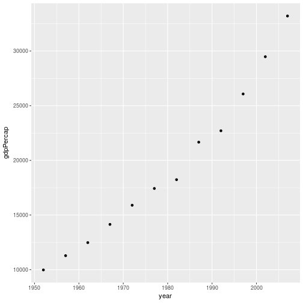
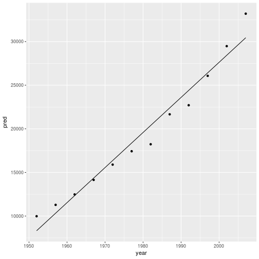

So far we've looked at exploratory analysis; loading our data, manipulating it and plotting it.  We often wish to fit a statistical model to the data.   The model(s) you need to fit will depend on your data and the questions you want to try and answer.

Fortunately, R will almost certainly be able to fit the model you are interested in, either using functions in the `stats` package (which comes with R), a library which implements your model in R code, or a library which calls a more specialised modelling language.   The [CRAN task views](https://cran.r-project.org/web/views/) are a good place to start if your preferred modelling approach isn't included in base R.

In this episode we will very briefly discuss fitting linear models in R.  The aim of this episiode is to give a flavour of how to fit a statistical model in R, and to point you to
further resources.  The episode is based on modelling section of [R for Data Science, by Grolemund and Wickham](http://r4ds.had.co.nz/).    For a more statistical and in-depth treatment, see, e.g. Linear Models with R, by Faraway.

As with the rest of the course, we'll use the gapminder data.  To make things a little 
more tractable, let's consider only data for the UK:

~~~
gapminder_uk <- gapminder %>% 
  filter(country == "United Kingdom")
~~~
{: .language-r}

To start with, let's plot GDP per capita as a function of time:

~~~
ggplot(data = gapminder_uk, aes(x=year, y=gdpPercap)) + geom_point()
~~~
{: .language-r}

This looks like it's (roughly) a straight line.

We can perform linear regression on the data using the `lm()` function:

~~~
lm(gdpPercap ~ year, data = gapminder_uk)
~~~
{: .language-r}

~~~

Call:
lm(formula = gdpPercap ~ year, data = gapminder_uk)

Coefficients:
(Intercept)         year  
  -777027.8        402.3  
~~~
{: .output}

This will fit the model:

$$\mbox{gdpPercap} = x_0 + x_1 \times \mbox{year}$$

We see that, according to the model, the UK's GDP per capita is growing by $400 per year (the gapminder data has GDP in [international dollars](https://en.wikipedia.org/wiki/Geary%E2%80%93Khamis_dollar)).  The intercept gives us the model's prediction of the GPD in year 0.  This doesn't make sense (the gdp has to be >0), and illustrates the perils of extrapolating from your data.   

## Saving your model

We can assign the model to a variable:

~~~
ukgdp_model <- lm(gdpPercap ~ year, data = gapminder_uk)
print(ukgdp_model)
~~~
{: .language-r}

~~~

Call:
lm(formula = gdpPercap ~ year, data = gapminder_uk)

Coefficients:
(Intercept)         year  
  -777027.8        402.3  
~~~
{: .output}

The `summary()` function will give us more details about the model. 

~~~
summary(ukgdp_model)
~~~
{: .language-r}

~~~

Call:
lm(formula = gdpPercap ~ year, data = gapminder_uk)

Residuals:
    Min      1Q  Median      3Q     Max 
-2153.9  -786.3  -277.6   977.9  2758.8 

Coefficients:
              Estimate Std. Error t value Pr(>|t|)    
(Intercept) -777027.82   48840.08  -15.91 1.98e-08 ***
year            402.33      24.67   16.31 1.56e-08 ***
---
Signif. codes:  0 '***' 0.001 '**' 0.01 '*' 0.05 '.' 0.1 ' ' 1

Residual standard error: 1475 on 10 degrees of freedom
Multiple R-squared:  0.9638,	Adjusted R-squared:  0.9601 
F-statistic: 265.9 on 1 and 10 DF,  p-value: 1.563e-08
~~~
{: .output}

## Model predictions

Let's compare the predictions of our model to the actual data.   We can do this using the `add_predictions()` function in `modelr`.  `modelr` is part of the tidyverse, but isn't loaded by default.

~~~
library(modelr)

gapminder_uk %>% 
  add_predictions(ukgdp_model) %>% 
  ggplot(aes(x=year, y=pred)) + geom_line() +
  geom_point(aes(y=gdpPercap))
~~~
{: .language-r}

The model we have fitted assumes linear (i.e. straight line) change with repsect to time.
It looks like this is a not entirely unreasonable, although there are systematic differences.  For example, the model predicts a larger GDP per capita than reality for all the data between 1967 and 1997.   

> ## Fitting other terms
> 
> We can add additional terms to our model; `?formula()` explains the syntax used.  For example, to fit a covariate, z, giving the model 
> 
> $$\mbox{gdpPercap} = x_0 + x_1 \times \mbox{year} + x_2 \times z$$
> 
> We would use:
> 
> 
> ~~~
> ukgdp_model_squared <- lm(gdpPercap ~ year + z , data = gapminder_uk)
> ~~~
> {: .language-r}
> 
> Note, however, if we wish to transform covariates you may need to use the `I()` function
> to prevent the transformation being interpreted as part of the model formula.  For example, to fit:
> 
> $$\mbox{gdpPercap} = x_0 + x_1 \times \mbox{year} + x_2 \times \mbox{year}^2$$
> 
> We use: 
> 
> 
> ~~~
> ukgdp_model_squared <- lm(gdpPercap ~ year + I(year^2) , data = gapminder_uk)
> ~~~
> {: .language-r}
> 
{: .callout}

## Model checking -- plotting residuals

We can formalise this a little more by plotting the model residuals. 

Briefly - residuals show us "what's left over" after fitting the model. If the model 
fits well we would expect these to be randomly distributed (i.e. no systematic patterns).

Extensive details on model checking and diagnostics are beyond the scope of the episode - in practice we would want to do much more, and also consider and compare the goodness of fit of other models.

We can add the model residuals to our tibble using the `add_residuals()` function in
`modelr`. 

~~~
gapminder_uk %>% 
  add_residuals(ukgdp_model) %>% 
  ggplot(aes(x = year, y = resid)) + geom_point()
~~~
{: .language-r}

This makes the systematic difference between our model's predictions and reality much more obvious.  If the model fitted well we would expect the residuals to appear randomly distributed about 0.

## Going further

This episode has barely scratched the surface of model fitting in R.  Fortunately most of the more complex models we can fit in R have a similar interface to `lm()`, so the process of fitting and checking is similar.

[Quick R](https://www.statmethods.net/) provides a good overview of various [standard statistical models](https://www.statmethods.net/stats/index.html) and [more advanced statistical models](https://www.statmethods.net/advstats/index.html).   

If you wish to fit Bayesian models in R, [RStan](http://mc-stan.org/users/interfaces/rstan) provides an interface to the [Stan](http://mc-stan.org) programming language.  The [rstanarm](https://cran.r-project.org/web/packages/rstanarm/index.html) package provides an `lm()` like interface to many common statistical models implemented in Stan, letting you fit a Bayesian model without having to code it from scratch.

If you are interested in machine learning approaches, the [`keras` package](https://keras.rstudio.com/) provides an R interface to the Keras library.

