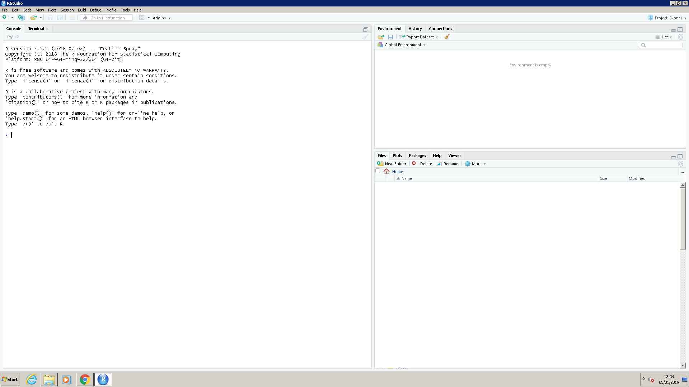
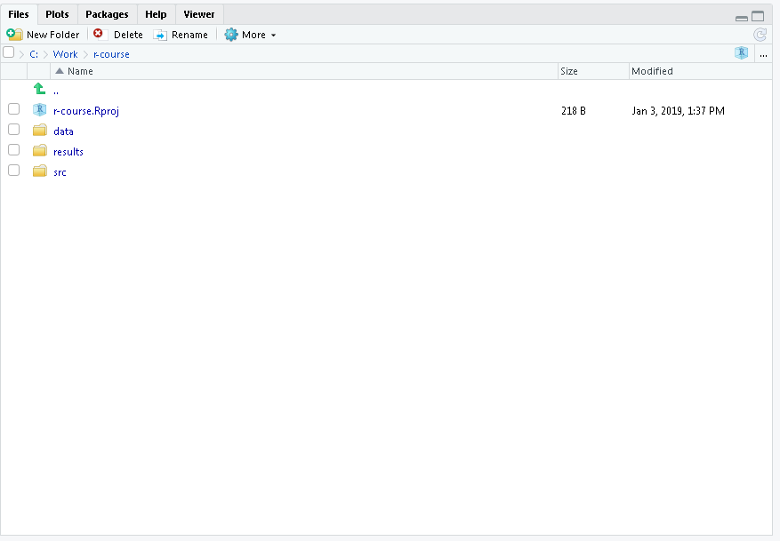
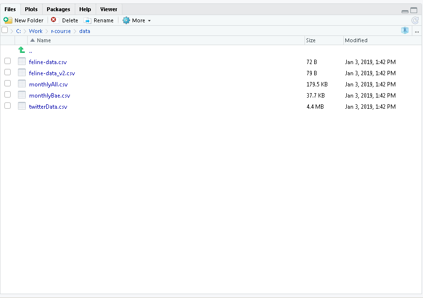

```{r, include=FALSE}
source("../bin/chunk-options.R")
knitr_fig_path("01-")
```


## Motivation

Science is a multi-step process: once you've designed an experiment and collected
data, the real fun begins! This lesson will teach you how to start this process using
R and RStudio. We will begin with raw data, perform exploratory analyses, and learn
how to plot results graphically. This example starts with a dataset from
[gapminder.org](https://www.gapminder.org) containing population information for many
countries through time. Can you read the data into R? Can you plot the population for
Senegal? Can you calculate the average income for countries on continent of Asia?
By the end of these lessons you will be able to do things like plot the populations
for all of these countries in under a minute!

## Before Starting The Workshop

If you are using your own computer, please ensure you have the latest version of R and RStudio installed on your machine. This is important, as some packages used in the workshop may not install correctly (or at all) if R is not up to date.

[Download and install the latest version of R here](https://www.r-project.org/)

[Download and install RStudio here](https://www.rstudio.com/)

**The University machines already have suitable versions of R and RStudio installed.**  

> ## RStudio
>
> The University machines have RStudio version 1 installed on them.  Version
> 1.1 of RStudio was released on 9 October 2017.  If you install RStudio on your
> own machine it will be version 1.1; by default this uses a different colour theme,
> however the layout of windows and buttons is similar.
> 
> Details of new features in version 1.1 can be found on the [page announcing its
> release](https://blog.rstudio.com/2017/10/09/rstudio-v1.1-released/)
>
{: .callout}

## Introduction to RStudio

Throughout this lesson, we're going to teach you some of the fundamentals of
the R language as well as some best practices for organizing code for
scientific projects that will make your life easier.

We'll be using RStudio: a free, open source R integrated development
environment. It provides a built in editor, works on all platforms (including
on servers) and provides many advantages such as integration with version
control and project management.

**Basic layout**

When you first open RStudio, you will be greeted by three panels:

  * The interactive R console (entire left)
  * Environment/History (tabbed in upper right)
  * Files/Plots/Packages/Help/Viewer (tabbed in lower right)




## Projects in R studio 

When we are perorming an analysis we will typically be using many files... 
input data, files containing code to perform the analysis, and results.    By creating a _project_ in
Rstudio we make it easier to manage these files.


> ## Challenge: Creating a self-contained project
>
> We're going to create a new project in RStudio:
>
> 1. Click the "File" menu button, then "New Project".
> 2. Click "New Directory".
> 3. Click "Empty Project".
> 4. Type in the name of the directory to store your project, e.g. "r_course". You should avoid using spaces and "."s in the project name.
> 5. If you are using a teaching cluster machine, choose "Browse" and select `C:\work`.  
> 6. Click the "Create Project" button.
{: .challenge}

> ## Project locations
> 
> We suggest you save your project in `c:\work` in case network access to the `P:` drive is lost during the course. Files in `c:\work` are stored locally on the machine, and are not backed up.  You should copy your project folder to the `P:` drive at lunchtime (in case you use a different machine after lunch) the end of the day (so you can refer to your work after).  
> 
{: .callout}

Now when we start R in this project directory, or open this project with RStudio,
all of our work on this project will be entirely self-contained in this directory.


## Good practices for project organization

Although there is no "best" way to lay out a project, there are some general
principles to adhere to that will make project management easier:

### Treat data as read only

This is probably the most important goal of setting up a project. Data is
typically time consuming and/or expensive to collect. Working with them
interactively (e.g., in Excel) where they can be modified means you are never
sure of where the data came from, or how it has been modified since collection.
It is therefore a good idea to treat your data as "read-only".

### Data Cleaning

In many cases your data will be "dirty": it will need significant preprocessing
to get into a format R (or any other programming language) will find useful. This
task is sometimes called "data munging". I find it useful to store these scripts
in a separate folder, and create a second "read-only" data folder to hold the
"cleaned" data sets.

### Treat generated output as disposable

Anything generated by your scripts should be treated as disposable: it should
all be able to be regenerated from your scripts.

There are lots of different ways to manage this output. I find it useful to
have an output folder with different sub-directories for each separate
analysis. This makes it easier later, as many of my analyses are exploratory
and don't end up being used in the final project, and some of the analyses
get shared between projects.

> ## Tip: Good Enough Practices for Scientific Computing
>
> [Good Enough Practices for Scientific Computing](https://github.com/swcarpentry/good-enough-practices-in-scientific-computing/blob/gh-pages/good-enough-practices-for-scientific-computing.pdf) gives the following recommendations for project organization:
>
> 1. Put each project in its own directory, which is named after the project.
> 2. Put text documents associated with the project in the `doc` directory.
> 3. Put raw data and metadata in the `data` directory, and files generated during clean-up and analysis in a `results` directory.
> 4. Put source for the project's scripts and programs in the `src` directory, and programs brought in from elsewhere or compiled locally in the `bin` directory.
> 5. Name all files to reflect their content or function.
>
{: .callout}


> ## Challenge
> 
> Create `data`, `src`, and `results` directories in your project directory.
> 
> Copy the files `gapminder-FiveYearData.csv`, `feline-data.csv`,  and `feline-data_v2.csv` files from the [zip file you downloaded]({{ page.root }}/data/r-novice.zip) as part of the lesson set up to the `data/` folder within your project.  We will load and use these files later in the course.
>
> Note that you cannot drag and drop files from Windows Explorer
> (or your operating system's equivalent) into the files window in RStudio.   You can
> get a new Windows Explorer (or equivalent) window for the location shown in the the
> files tab of RStudio by clicking "More" and selecting "Show folder in new window".
> You can then drag and drop the the required files into the folder.
>
> You may find that you need to click the "refresh" icon in RStudio's file window
> before the files appear in RStudio.
>
> > ## Solution
> > Your project structure should look like this:
> > 
> > 
> >
> > The data directory should looks like this:
> >
> > 
> > 
> > Note that the path ("Home > training > ...") will vary according to where you created the project.
> {: .solution}
{: .challenge}


## Introduction to R

Much of your time in R will be spent in the R interactive
console. This console in RStudio is the same as the one you would get if
you typed in `R` in your command-line environment.

The first thing you will see in the R interactive session is a bunch
of information, followed by a `>` and a blinking cursor. It operates
on the idea of a "Read, evaluate, print loop": you type in commands,
R tries to execute them, and then returns a result.

## Using R as a calculator

The simplest thing you could do with R is do arithmetic:

```{r}
1 + 100
```

And R will print out the answer, with a preceding `[1]`. Don't worry about this
for now, we'll explain that later. For now think of it as indicating output.

Like bash, if you type in an incomplete command, R will wait for you to
complete it:

~~~
> 1 +
~~~
{: .r}

~~~
+
~~~
{: .output}

Any time you hit return and the R session shows a `+` instead of a `>`, it
means it's waiting for you to complete the command. If you want to cancel
a command you can simply hit `Esc` and RStudio will give you back the `>`
prompt.

> ## Tip: Cancelling commands
>
> If you're using R from the command line instead of from within RStudio,
> you need to use `Ctrl+C` instead of `Esc` to cancel the command. This
> applies to Mac users as well!
>
> Cancelling a command isn't only useful for killing incomplete commands:
> you can also use it to tell R to stop running code (for example if it's
> taking much longer than you expect), or to get rid of the code you're
> currently writing.
>
{: .callout}

When using R as a calculator, the order of operations is the same as you
would have learned back in school.

From highest to lowest precedence:

 * Parentheses: `(`, `)`
 * Exponents: `^` or `**`
 * Divide: `/`
 * Multiply: `*`
 * Add: `+`
 * Subtract: `-`

```{r}
3 + 5 * 2
```

Use parentheses to group operations in order to force the order of
evaluation if it differs from the default, or to make clear what you
intend.

```{r}
(3 + 5) * 2
```

This can get unwieldy when not needed, but  clarifies your intentions.
Remember that others may later read your code.

```{r, eval=FALSE}
(3 + (5 * (2 ^ 2))) # hard to read
3 + 5 * 2 ^ 2       # clear, if you remember the rules
3 + 5 * (2 ^ 2)     # if you forget some rules, this might help
```


The text after each line of code is called a
"comment". Anything that follows after the hash symbol
`#` is ignored by R when it executes code.

## Saving our commands

Although we can use R in this interactive way, we will usually write our
commands into a file.  This way we (and others) can follow the steps
performed in our analysis, and we (and others) can re-run them if required.

We can create a new script by choosing the menu item: `File, New File, R script`, or with the keyboard
shortcut <kbd>Ctrl</kbd> + <kbd>Shift</kbd> + <kbd>N</kbd>.    Commands we type in here
won't be excuted immediately.

Script files are text files.  By convention they have the extension `.R`.

You can execute the command that the cursor is currently on by pressing <kbd>Ctrl</kbd>+<kbd>Enter</kbd> (the cursor does not have to be at the start of the command, and the command can extend over more than one line, provided a single line does not make a complete command - you will explore this in the challenge below).  

If you have selected some code, <kbd>Ctrl</kbd>+<kbd>Enter</kbd> will execute the selection.

To run all of the code in the script, press <kbd>Ctrl</kbd>+<kbd>Shift</kbd>+<kbd>Enter</kbd>.

## Challenge


Create a new script file, and save it with the name `courseintro.R` in the `src` directory you created earlier.   Enter a few commands into this, and try running them.   What happens if you enter:

```
1 +
2
```

Does the position of the `+` sign matter?  Does entering
```
1
+ 2
``` 
work?

## Solution

You will find that writing 
```
1
+ 2
```
is interpreted as two separate commands.   In contrast:
```
1 + 
 2
```
is run as a single command.  `1 +` does not make up a complate R command (if we enter this in the console we would see the `+` prompt).    You may have noticed that when you entered this command into the script RStudio indents the second line; this makes it clearer to us that the line is a continuation of the previous command.

We will make extensive use of this feature when we start writing data analysis pipelines.

{: .solution}
{: .challenge}


> ## Version control
> 
> It is always a good idea to use version control with your projects.  
> This makes it easy to undo changes to your code, scripts and documents, and to collaborate with others. 
> We don't cover version control in this course, however [Research IT offers a course on using git](http://app.manchester.ac.uk/RGIT)
> (logon required). [Git](https://git-scm.com/) is a popular version control system, 
> that integrates well with Rstudio.  Git makes collaboration with others easy when it is used in 
> conjunction with [github](https://www.github.com).
{: .callout}


> ## The history tab
>
> RStudio keeps a log of the command you've entered.  This makes it 
easier to go back and edit a command if you've made a mistake in it.
There are several ways of accessing the command history:
>
> 1. In the console window, the up and down arrows will take you 
through the command history. (The command can then be edited using the
left and right arrow keys)
> 2. The history tab in the top right of RStudio contains the command history.  One
or more lines from this can be selected.  These can then be copied to the console, or to
your R script by pressing the appropriate button.
{: .callout}


## Mathematical functions

R has many built in mathematical functions. To call a function,
we simply type its name, followed by  open and closing parentheses.
Anything we type inside the parentheses are called the function's
arguments:

```{r}
sin(1)  # trigonometry functions
```

```{r}
log(1)  # natural logarithm
```

```{r}
log10(10) # base-10 logarithm
```

```{r}
exp(0.5) # e^(1/2)
```

## Remembering function names and arguments

Don't worry about trying to remember every function in R. You
can simply look them up on Google, or if you can remember the
start of the function's name, type the start of it, then press the `tab` key.
This will show a list of
functions whose name matches what you've typed so far; this is known
as `tab completion`, and can save a lot of typing (and reduce the risk
of typing errors).  Tab completion works in R (i.e. running it out
of RStudio), and in RStudio. In RStudio this feature is even more useful; a
extract of the function's help file will be shown alongside the function name.

This is one advantage that RStudio has over R on its own: it
has auto-completion abilities that allow you to more easily
look up functions, their arguments, and the values that they
take.

Typing a `?` before the name of a command will open the help page
for that command. As well as providing a detailed description of
the command and how it works, scrolling to the bottom of the
help page will usually show a collection of code examples which
illustrate command usage. We'll go through an example later.


## Comparing things

We can also do comparison in R:

```{r}
1 == 1  # equality (note two equals signs, read as "is equal to")
```

```{r}
1 != 2  # inequality (read as "is not equal to")
```

```{r}
1 < 2  # less than
```

```{r}
1 <= 1  # less than or equal to
```

```{r}
1 > 0  # greater than
```

```{r}
1 >= -9 # greater than or equal to
```

> ## Tip: Comparing Numbers
>
> A word of warning about comparing numbers: you should
> never use `==` to compare two numbers unless they are
> integers (a data type which can specifically represent
> only whole numbers).
>
> Computers may only represent decimal numbers with a
> certain degree of precision, so two numbers which look
> the same when printed out by R, may actually have
> different underlying representations and therefore be
> different by a small margin of error (called Machine
> numeric tolerance).
>
> Instead you should use the `all.equal` function.
>
> Further reading: [http://floating-point-gui.de/](http://floating-point-gui.de/)
>
{: .callout}

## Variables and assignment

We can store values in variables using the assignment operator `<-`, like this:

```{r}
x <- 1/40
```

Notice that assignment does not print a value. Instead, we stored it for later
in something called a **variable**. `x` now contains the **value** `0.025`:

```{r}
x
```

More precisely, the stored value is a *decimal approximation* of
this fraction called a [floating point number](http://en.wikipedia.org/wiki/Floating_point).

Look for the `Environment` tab in one of the panes of RStudio, and you will see that `x` and its value
have appeared. Our variable `x` can be used in place of a number in any calculation that expects a number:

```{r}
log(x)
```

Notice also that variables can be reassigned:

```{r}
x <- 100
```

`x` used to contain the value 0.025 and and now it has the value 100.

Assignment values can contain the variable being assigned to:

```{r}
x <- x + 1 #notice how RStudio updates its description of x on the top right tab
```

The right hand side of the assignment can be any valid R expression.
The right hand side is *fully evaluated* before the assignment occurs.

> ## Legal variable names
> Variable names can contain letters, numbers, underscores and periods.
> They cannot start with a number nor contain spaces at all.
> Different people use different conventions for long variable names, these include:
>
>  * periods.between.words
> * underscores\_between_words
>  * camelCaseToSeparateWords
>
> What you use is up to you, but **be consistent**.
> 
> Variables that start with a "." are hidden variables.  These will not appear in the environment window
> or when we use the `ls()` function (unless we us `ls(all.names = TRUE)`. The `ls()` function is introduced in the next episode.  Hidden variables are used for things
> such as storing R's random number seed, which we typically don't want to change within a session.
{: .callout}

It is also possible to use the `=` operator for assignment:

```{r}
x = 1/40
```

But this is much less common among R users.  The most important thing is to
**be consistent** with the operator you use. There are occasionally places
where it is less confusing to use `<-` than `=`, and it is the most common
symbol used in the community. So the recommendation is to use `<-`.

We aren't limited to storing numbers in variables:

```{r}
sentence <- "the cat sat on the mat"
```

Note that we need to put strings of characters inside quotes.  

But the type of data that is stored in a variable affects what we can do with it:

```{r}
x + 1
sentence + 1
```

We will discuss the important concept of _data types_ in the next episode.  


> ## Challenge 1
>
> Which of the following are valid R variable names?
> ```
> min_height
> max.height
> _age
> MaxLength
> min-length
> 2widths
> celsius2kelvin
> ```
>
> > ## Solution to challenge 1
> >
> > The following can be used as R variables:
> > ```
> > min_height
> > max.height
> > MaxLength
> > celsius2kelvin
> > ```
> >
> > The following will not be able to be used to create a variable
> > ```
> > _age
> > min-length
> > 2widths
> > ```
> {: .solution}
{: .challenge}

> ## Challenge 2
>
> What will be the value of each  variable  after each
> statement in the following program?
>
> ```{r, eval=FALSE}
> mass <- 47.5
> age <- 122
> mass <- mass * 2.3
> age <- age - 20
> ```
>
> > ## Solution to challenge 2
> >
> > ```{r ch2pt1-sol}
> > mass <- 47.5
> > ```
> > This will give a value of `r mass` for the variable mass
> >
> > ```{r ch2pt2-sol}
> > age <- 122
> > ```
> > This will give a value of `r age` for the variable age
> >
> > ```{r ch2pt3-sol}
> > mass <- mass * 2.3
> > ```
> > This will multiply the existing value of `r mass/2.3` by 2.3 to give a new value of
> > `r mass` to the variable mass.
> >
> > ```{r ch2pt4-sol}
> > age <- age - 20
> > ```
> > This will subtract 20 from the existing value of `r age + 20 ` to give a new value
> > of `r age` to the variable age.
> {: .solution}
{: .challenge}


> ## Challenge 3
>
> Run the code from the previous challenge, and write a command to
> compare mass to age. Is mass larger than age?
>
> > ## Solution to challenge 3
> >
> > One way of answering this question in R is to use the `>` to set up the following:
> > ```{r ch3-sol}
> > mass > age
> >```
> > This will yield a boolean value of TRUE since `r mass` is greater than `r age`.
> {: .solution}
{: .challenge}

## Vectorization

As well as dealing with single values, we can work with vectors of values.  
There are various ways of creating vectors; the `:` operator will generate sequences of
consecutive values:

```{r}
1:5
-3:3

5:1
```

The result of the `:` operator is a _vector_; this is a 1 dimensional array of values.
We can apply functions to all the elements of a vector:

```{r}
(1:5) * 2
2^(1:5)
```

We can assign a vector to a variable:

```{r}
x <- 5:10
```

We can also create vectors "by hand" using the `c()` function; this tersely named function is used to _combine_ values into a vector; these values can, themselves, be vectors:

```{r}
c(2, 4, -1)
c(x, 2, 2, 3)
```

Vectors aren't limited to storing numbers:

```{r}
c("a", "b", "c", "def")
```

R comes with a few built in vectors containing useful sequences:
```{r}
LETTERS
letters
month.abb
month.name
pi
```


## Vector lengths

We can calculate how many elements a vector contains using the `length()` function:

```{r}
length(x)
length(letters)
```


## Subsetting vectors

Having defined a vector, it's often useful to _extract_ parts of a vector.   We do this with the
`[]` operator.  Using the built in `month.name` vector:

```{r}
month.name[2]
month.name[2:4]
```

Let's unpick the second example; `2:4` generates the sequence 2,3,4.   This gets passed to the 
extract operator `[]`.   We can also generate this sequence using the `c()` function:

```{r}
month.name[c(2,3,4)]
```

> ## Vector numbering in R starts at 1
>
> In many programming languages (C and python, for example), the first
> element of a vector has an index of 0. In R, the first element is 1.
{: .callout}

We can pass the extract operator a vector of indices that we wish to extract:
```{r}
month.name[c(1,2,3)]
month.name[c(11,12)]
```

Values are returned in the order that we specify the indices.  We can extract the same element more 
than once:

```{r}
month.name[4:2]
month.name[c(1,1,2,3,4)]
```

> ## Challenge 4
> 
> Return a vector containing the letters of the alphabet in reverse order
>
> > ## Solution to challenge 4
> > We can extract the elements in reverse order by generating the sequence
> > 26, 25, ... 1 using the `:` operator:
> >
> > ```{r}
> > letters[length(letters):1]
> > ```
> > 
> > Why didn't we just use `letters[26:1]`?  By hard-coding the length of the
> > variable into our code, we're making an assumption that `letters` will always
> > be length 26.  Although this is probably a safe assumption in English, other
> > languages may have more (or fewer) letters in their alphabet.   It is good
> > practice to avoid hard-coding information about your data into your scripts.
> > We will talk about testing assumptions at the very end of the course.
> {: .solution}
{: .challenge}


If we try and extract an element that doesn't exist in the vector, the missing values are `NA`:

```{r}
month.name[10:13]
```

## Missing data

`NA` is a special value, that is used to represent "not available", or "missing".  If we perform computations which include `NA`, the result is usually `NA`:

```{r}
1 + NA
```

This raises an interesting point; how do we test if a value is `NA`?  This doesn't work:

```{r}
x <- NA
x == NA
```

## Handling special values

There are a number of special functions you can use to handle missing data, and other special values:

 * `is.na` will return all positions in a vector, matrix, or data.frame
   containing `NA`.
 * likewise, `is.nan`, and `is.infinite` will do the same for `NaN` and `Inf`.
 * `is.finite` will return all positions in a vector, matrix, or data.frame
   that do not contain `NA`, `NaN` or `Inf`.
 * `na.omit` will filter out all missing values from a vector

## Skipping and removing elements

If we use a negative number as the index of a vector, R will return
every element *except* for the one specified:

```{r}
month.name[-2]
```

We can skip multiple elements:

```{r}
month.name[c(-1, -5)]  # or month.name[-c(1,5)]
```

> ## R's results prompt
> 
> We saw that R returns results prefixed with a `[1]`.  This is the index of the first 
> element of the results vector on that line of results.  This is useful if we're returning 
> vectors that are too long to fit on a single row.
>
{: .callout}

> ## Tip: Order of operations
>
> A common error occurs when trying to skip
> slices of a vector. Most people first try to negate a
> sequence like so:
>
> ```{r, error=TRUE, eval=FALSE}
> month.name[-1:3]
> ```
>
> This gives a somewhat cryptic error:
>
> ```{r, error=TRUE, echo=FALSE}
> month.name[-1:3]
> ```
>
> But remember the order of operations. `:` is really a function, so
> what happens is it takes its first argument as -1, and second as 3,
> so generates the sequence of numbers: `-1, 0, 1, 2, 3`.
>
> The correct solution is to wrap that function call in brackets, so
> that the `-` operator is applied to the sequence:
>
> ```{r}
> -(1:3)
> month.name[-(1:3)]
> ```
{: .callout}

## Subsetting with logical vectors 

As well as providing a list of indices we want to keep (or delete, if we prefix them with `-`), we 
can pass a _logical vector_ to R indicating the indices we wish to select:

```{r}
fourmonths <- month.name[1:4]
fourmonths

fourmonths[c(TRUE, FALSE, TRUE, TRUE)]
```

What happens if we supply a logical vector that is shorter than the vector we're extracting the elements from?

```{r}
fourmonths[c(TRUE,FALSE)]
```

This illustrates the idea of _vector recycling_; the `[]` extract operator "recycles" the subsetting vector:

```{r}
fourmonths[c(TRUE,FALSE,TRUE,FALSE)]
```

This can be useful, but can easily catch you out.

The idea of selecting elements of a vector using a logical subsetting vector may seem a bit esoteric, and a lot more
typing than just selecting the elements you want by index.  It becomes really useful when we write code to generate
the logical vector:

```{r}
my_vector <- c(0.01, 0.69, 0.51, 0.39)
my_vector > 0.5
my_vector[my_vector > 0.5]
```

> ## Tip: Combining logical conditions
>
> There are many situations in which you will wish to combine multiple logical
> criteria. For example, we might want to find all the elements that are 
> between two values. Several operations for combining logical vectors exist in R:
>
>  * `&`, the "logical AND" operator: returns `TRUE` if both the left and right
>    are `TRUE`.
>  * `|`, the "logical OR" operator: returns `TRUE`, if either the left or right
>    (or both) are `TRUE`.
>
> The recycling rule applies with both of these, so `TRUE & c(TRUE, FALSE, TRUE)`
> will compare the first `TRUE` on the left of the `&` sign with each of the
> three conditions on the right.
>
> You may sometimes see `&&` and `||` instead of `&` and `|`. These operators
> do not use the recycling rule: they only look at the first element of each
> vector and ignore the remaining elements. The longer operators are mainly used
> in programming, rather than data analysis.
>
>  * `!`, the "logical NOT" operator: converts `TRUE` to `FALSE` and `FALSE` to
>    `TRUE`. It can negate a single logical condition (e.g. `!TRUE` becomes
>    `FALSE`), or a whole vector of conditions(e.g. `!c(TRUE, FALSE)` becomes
>    `c(FALSE, TRUE)`).
>
> Additionally, you can compare the elements within a single vector using the
> `all` function (which returns `TRUE` if every element of the vector is `TRUE`)
> and the `any` function (which returns `TRUE` if one or more elements of the
> vector are `TRUE`).
{: .callout}


> ## Challenge 5
>
> Given the following code:
>
> ```{r}
> x <- c(5.4, 6.2, 7.1, 4.8, 7.5)
> print(x)
> ```
>
> Come up with at least 3 different commands that will produce the following output:
>
> ```{r, echo=FALSE}
> x[2:4]
> ```
>
> After you find 3 different commands, compare notes with your neighbour. Did you have different strategies?
>
> > ## Solution to challenge 5
> >
> > ```{r}
> > x[2:4]
> > ```
> > ```{r}
> > x[-c(1,5)]
> > ```
> > ```{r}
> > x[c(2,3,4)]
> > ```
> > ```{r}
> > x[c(FALSE, TRUE, TRUE, TRUE, FALSE)]
> > ```
> >
> > (We can use vector recycling to make the last example slightly shorter:
> > ```{r}
> > x[c(FALSE, TRUE, TRUE, TRUE)]
> > ```
> > The first element of the logical vector will be recycled)
> {: .solution}
{: .challenge}


## Data types

One thing you may have noticed is that all the data in a vector has been the same type; all the elements have had the same type (i.e. they have all been numbers, all been character, or all been logical (`TRUE`/`FALSE`)).  This is an important property of vectors; the type of data the vector holds is a property of the vector, not of each element.  Let's look at what happens if we try to create a vector of numeric and character data:

```{r}
c(1, 2, "three", "four", 5)
```

We see that R has coerced the elements containing digits to strings, so that all the elements have the same type.  We will talk more about data types in a later episode.


## Managing your environment

In this section we will discuss ways of keeping your environment tidy.

`ls` will list all of the variables and functions stored in the global environment
(your working R session):

```{r}
ls()
```

Information on the objects in your environment is also available from the environment panel in RStudio.

> ## Tip: hidden objects
>
> Like in the shell, `ls` will hide any variables or functions starting
> with a `.` by default. To list all objects, type `ls(all.names=TRUE)`
> instead
>
{: .callout}

Note here that we didn't given any arguments to `ls`, but we still
needed to give the parentheses to tell R to call the function.

You can use `rm` to delete objects you no longer need. To delete `x`:

```{r, error=TRUE}
x <- 5
x
rm(x)
# x has now been deleted; so trying to access it will give an error
x
```

If you have lots of things in your environment and want to delete all of them,
you can pass the results of `ls` to the `rm` function:

```{r, eval = FALSE}
rm(list = ls())
```

In this case we've combined the two. Like the order of operations, anything
inside the innermost parentheses is evaluated first, and so on.

In this case we've specified that the results of `ls` should be used for the
`list` argument in `rm`. When assigning values to arguments by name, you *must*
use the `=` operator, and not `<-`

If instead we use `<-`, there will be unintended side effects, or you may get an error message:

```{r, error=TRUE}
rm(list <- ls())
```

> ## Tip: Warnings vs. Errors
>
> Pay attention when R does something unexpected! Errors, like above,
> are thrown when R cannot proceed with a calculation. Warnings on the
> other hand usually mean that the function has run, but it probably
> hasn't worked as expected.
>
> In both cases, the message that R prints out usually give you clues
> how to fix a problem.
>
{: .callout}

## Starting a new session 

Removing all the objects in our environment isn't quite the same as starting a fresh session of R.  Packages that we have previously loaded will remain loaded, and hidden variables (which are those that start with a ".") won't be deleted (unless we use `ls(all.names = TRUE)`).

Before running our analysis script it is a good idea to restart your R session.  This way we *know* that we have loaded all the packages we need, and don't use any variables we've defined outside of the script, because the script will fail.  You can start a fresh session of R from within RStudio by pressing <kbd>Ctrl</kbd>+<kbd>Shift</kbd>+<kbd>F10</kbd>, or choosing "Restart R" from the "Session" menu.

## Comments

If we include the `#` symbol in a command in R, everything following it will be ignored.  This
lets us enter comments into our code.  


## Working directory

FIXME - mention this - common problem in classes